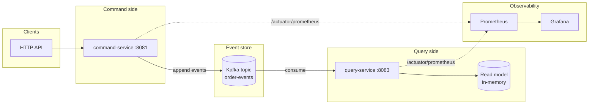

# Event-Sourced CQRS

A **production-style** demo of **Event Sourcing** and **CQRS** on the JVM: commands write events to **Apache Kafka** (event store), the **query side** consumes events and builds a read model, with **observability** via Prometheus and Grafana.

[](https://openjdk.org/)
[](https://spring.io/projects/spring-boot)
[](https://kafka.apache.org/)
[](https://gradle.org/)
[](https://www.docker.com/)
[](https://prometheus.io/)
[](https://grafana.com/)

---

## Features

| Feature | Description |
|--------|-------------|
| **Event Sourcing** | Order state is derived from an append-only event log (Kafka topic). |
| **CQRS** | Separate **command** (write) and **query** (read) services; no shared database. |
| **Kafka as event store** | Single topic per aggregate type; partition key = aggregate ID for ordering. |
| **Polytype events** | `OrderCreated` and `OrderConfirmed` with Jackson polymorphic (de)serialization. |
| **Observability** | Micrometer → Prometheus; Grafana dashboard with custom counters. |
| **Single-command run** | `docker compose up -d` brings up Kafka, both services, Prometheus, and Grafana. |
| **Tests** | Unit tests for command/query logic; MockMvc for REST controllers. |

---

## Architecture



**Flow:** Commands (e.g. create order, confirm order) are handled by **command-service**, which appends events to Kafka. **query-service** consumes the same topic and updates an in-memory read model. Reads go only to the query side.

---

## Tech stack

- **Java 21**
- **Spring Boot 3.2** (Web, Kafka, Actuator)
- **Micrometer** + **Prometheus** registry
- **Apache Kafka** (KRaft, single node in Docker)
- **Gradle 8** (Kotlin DSL), multi-module: `events`, `command-service`, `query-service`
- **Docker Compose** for Kafka, Prometheus, Grafana, and both apps

---

## Quick start

**Prerequisites:** Docker and Docker Compose.

```bash
git clone https://github.com/<your-username>/event-sourced-cqrs.git
cd event-sourced-cqrs
docker compose up -d --build
```

Wait until all containers are up (Kafka may take ~30–45s to become healthy). Then:

| Component        | URL / Port | Description                    |
|------------------|------------|--------------------------------|
| Command API      | http://localhost:8081 | Create / confirm orders |
| Query API        | http://localhost:8083 | Read order by ID        |
| Prometheus       | http://localhost:9090 | Metrics                  |
| Grafana          | http://localhost:3000 | Dashboards (admin / admin) |

---

## API examples

**Create an order**

```bash
curl -s -X POST http://localhost:8081/api/orders \
  -H "Content-Type: application/json" \
  -d '{"customerId":"customer-1","amount":"99.99"}'
# Returns order ID (UUID)
```

**Read the order** (after a short delay for event processing)

```bash
curl -s http://localhost:8083/api/orders/<ORDER_ID>
```

**Confirm the order**

```bash
curl -s -X POST http://localhost:8081/api/orders/<ORDER_ID>/confirm \
  -H "Content-Type: application/json" \
  -d '{"orderId":"<ORDER_ID>","products":["item-A","item-B"]}'
# 204 No Content
```

**Read again** — the order will show `confirmed: true` and `products`.

---

## Project structure

```
event-sourced-cqrs/
├── events/                 # Shared event types and topic name (no Spring)
├── command-service/        # REST API → events to Kafka
├── query-service/          # Kafka consumer → read model, GET by ID
├── docker-compose.yml      # Kafka, command-service, query-service, Prometheus, Grafana
├── Dockerfile              # Multi-service image (both apps)
├── prometheus.yml          # Scrape config (host)
├── prometheus-docker.yml   # Scrape config (Docker)
├── grafana/
│   └── provisioning/       # Datasource + dashboard
├── LICENSE
└── README.md
```

---

## Monitoring

- **Prometheus** scrapes `/actuator/prometheus` from both services.
- **Grafana** is preconfigured with a **Prometheus** datasource and an **Event-sourced CQRS** dashboard with panels for:
  - Orders created
  - Orders confirmed
  - Events processed (query-side)

Default login: `admin` / `admin`. Change the password in production.

---

## Running tests

```bash
./gradlew test
```

---

## License

[MIT](LICENSE) — see [LICENSE](LICENSE) for details.
